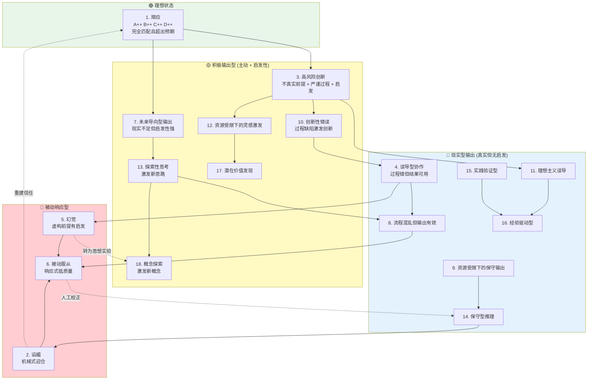

# HAICD 状态关系图谱

## Graphviz 源文件

Graphviz 源文件：`haicd-state-graph.dot`

**生成 PNG 命令**（需要安装 Graphviz）：
```bash
# macOS
brew install graphviz
dot -Tpng haicd-state-graph.dot -o haicd-state-graph.png

# Linux
sudo apt-get install graphviz
dot -Tpng haicd-state-graph.dot -o haicd-state-graph.png

# Windows
# 下载 https://graphviz.org/download/
# 安装后使用 Git Bash 或 CMD:
dot -Tpng haicd-state-graph.dot -o haicd-state-graph.png
```

---

## Mermaid 版本（可直接渲染）



---

## ABCD 维度说明

| 维度 | 子维度 | 取值范围 | 含义 |
|------|--------|---------|------|
| **A** 出发点 | A_f 灵活度 | [0, 1] | 思维灵活性 |
| | A_t 真实性 | [0, 1] | 前提真实性 |
| **B** 过程 | B_l 逻辑自洽 | [0, 1] | 推理一致性 |
| | B_c 正确性 | [0, 1] | 推理正确性 |
| **C** 资源 | C_a 可及性 | [0, 1] | 资源可获得 |
| | C_s 稳定性 | [0, 1] | 资源稳定 |
| **D** 结论 | D_r 现实性 | [0, 1] | 结论可实现 |
| | D_i 启发性 | [0, 1] | 启发价值 |

---

## 状态聚类说明

### 理想状态 (1 种)
- **顺应**：全维度优秀，智能体输出的理想状态

### 积极输出型 (7 种)
特征：主动发起 (M=1) + 启发性强 (I=1)
- 适用于：科研探索、创新场景、思想实验

### 现实型输出 (7 种)
特征：真实性高 (R=1) + 启发性低 (I=0)
- 适用于：常规任务、事实验证、稳定输出

### 被动响应型 (3 种)
特征：被动响应 (M=0) + 启发性低 (I=0)
- 适用于：简单任务、情感支持（谄媚）、或需避免的状态

---

## 状态迁移规律

### 升级路径（虚线）
- 人工校正：被动 → 现实
- 重建信任：谄媚 → 顺应
- 转为思想实验：幻觉 → 概念探索

### 降级路径（实线）
- 创新需求 → 高风险 → 过程缺陷 → 误导
- 资源受限 → 保守输出 → 质量下降 → 被动服从
- 前提虚构 → 幻觉 → 启发性丧失

---

## 使用指南

### 开发者
1. 参考状态关系图理解 18 种状态的逻辑关系
2. 根据场景选择初始状态
3. 监控状态流，适时调整

### 研究者
1. 分析状态迁移规律
2. 研究状态适配的用户体验
3. 扩展新的有意义状态

### 最终用户
1. 无需了解内部状态（默认隐藏）
2. 通过交互质量感受状态适配
3. 可主动查询当前状态模式

---

## 文件清单

| 文件 | 说明 |
|------|------|
| `haicd-state-graph.dot` | Graphviz 源文件 |
| `haicd-state-graph.md` | 本文档（含 Mermaid 版本） |
| `haicd-scoring-system.py` | 原型评分系统（待创建） |
| `haicd-weights-template.yaml` | 权重配置模板（待创建） |
